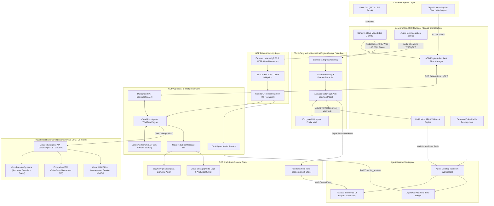
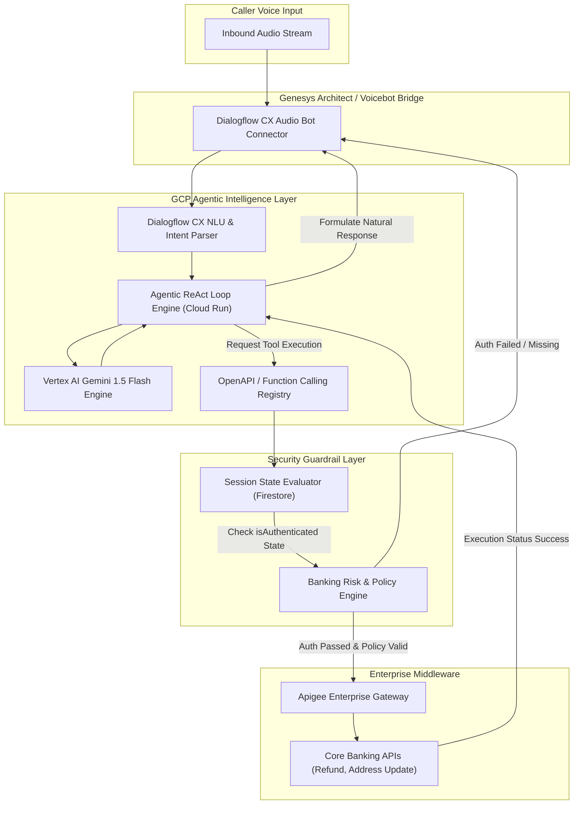
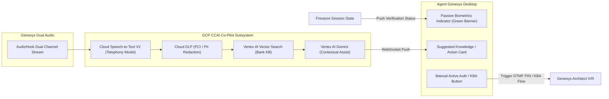

# High Street Bank Contact Centre Modernization

## Engineering Architecture Specification: Agentic AI & Passive Voice Biometrics Platform

---

## 1. Executive Summary & Architectural Vision

This specification defines the production-grade engineering architecture for modernizing a Tier-1 High Street Bank's Contact Centre. The solution integrates **Genesys Cloud CX** (as the CCaaS orchestration and telephony engine) with **Google Cloud Platform (GCP)** (for Agentic AI, NLU, and Real-Time Co-Pilot) and a **Passive Voice Biometrics Engine** (e.g., Auraya EVA / Veridas) via real-time media streaming.

```
┌──────────────────────────────────────────────────────────────────────────────────┐
│                             HIGH STREET BANK CCaaS ENGINE                        │
│                           Genesys Cloud CX (Telephony/ACD)                       │
└─────────────────────────┬──────────────────────────────┬─────────────────────────┘
                          │                              │
                          │ AudioHook (gRPC / WS)        │ Real-time Event Stream
                          ▼                              ▼
┌─────────────────────────────────────────┐  ┌─────────────────────────────────────┐
│    PASSIVE VOICE BIOMETRICS ENGINE      │  │        GOOGLE CLOUD PLATFORM        │
│   (Auraya EVA / Veridas / Custom Engine)│  │     Agentic AI & Agent Assist       │
└─────────────────────────┬───────────────┘  └──────────────────┬──────────────────┘
                          │                                     │
                          │ Async Webhook / Event               │ Function Calling
                          └───────────────────┬─────────────────┘
                                              ▼
┌──────────────────────────────────────────────────────────────────────────────────┐
│                         ENTERPRISE API GATEWAY (Apigee)                          │
│                      Core Banking | CRM | Fraud Systems                          │
└──────────────────────────────────────────────────────────────────────────────────┘

```

### Key Capabilities Introduced

1. **Passive Voice Biometrics**: Silent, continuous identity verification operating during IVR navigation, Agentic AI dialogue, or human agent interactions via dual-channel AudioHook streaming.
2. **Customer-Facing Agentic AI**: Autonomous digital workers executing multi-turn dialog, handling intent recognition, and invoking secure banking API tool calls without human intervention when passive authentication succeeds.
3. **Real-Time Agent Co-Pilot (Agent Assist)**: Live transcription, automated knowledge RAG, passive verification status screen pops, next-best-action (NBA) guidance, and automated interaction summarization.

---

## 2. L2 Container Level Architecture Diagram

The L2 diagram defines the container boundaries, transport protocols, network isolation boundaries, and core system interfaces across Genesys Cloud CX, GCP, Third-Party Voice Biometrics, and the Bank’s On-Premises/Private Cloud Core Network.



---

## 3. L3 Component Level Architecture Diagrams

### 3.1 Passive Voice Authentication & Media Forking Pipeline

This component illustrates how raw dual-channel audio is split by Genesys Cloud CX and streamed simultaneously to the Voice Biometrics Engine and GCP Speech-to-Text pipelines, triggering asynchronous state updates without disrupting user conversation.

```mermaid
graph LR

    subgraph Genesys_Media_Edge["Genesys Media Edge"]
        RTP_Tap["AudioHook Media Tap"]
    end

    subgraph Biometrics_Engine["Voice Biometrics Runtime (Veridas / Auraya)"]
        WSS_Receiver["WebSocket / gRPC Audio Receiver"]
        VAD_Filter["Voice Activity Detector & Noise Filter"]
        Anti_Spoof["Liveness & Synthetic Voice Detector"]
        Feature_Extractor["Acoustic Feature Extractor"]
        Matcher["1:1 Profile Matcher (Score > Threshold)"]
    end

    subgraph Orchestration_Bus["Event & State Management"]
        Auth_Webhook["Biometrics Webhook Handler (Cloud Run)"]
        Genesys_Participant_API["Genesys Participant Data API"]
        Firestore_Session["Firestore Active Session State"]
    end

    RTP_Tap -->|Raw PCM Audio Stream| WSS_Receiver
    WSS_Receiver --> VAD_Filter
    VAD_Filter --> Anti_Spoof
    Anti_Spoof -->|Liveness Confirmed| Feature_Extractor
    Feature_Extractor --> Matcher
    Matcher -->|Confidence Score e.g. 0.96| Auth_Webhook

    Auth_Webhook -->|Set attribute: isAuthenticated=true| Genesys_Participant_API
    Auth_Webhook -->|Update Auth State| Firestore_Session

```



### 3.2 Agentic AI Voicebot & Autonomous Execution Engine

This pipeline handles autonomous voice conversations. The Agentic AI leverages dynamic tool calling to query banking backends, guarded by authentication flags continuously emitted by the Voice Biometrics Engine.



### 3.3 Real-Time Co-Pilot & Passive Verification Desktop Screen Pop

This pipeline drives the agent desktop experience, delivering live transcription, passive voice biometric verification indicators, and AI-generated answer recommendations during live agent interactions.



---

## 4. Operational Workflows & Architectural Execution

### Workflow 1: Passive Authentication in IVR & Agentic AI Self-Service

| Step | Component | Action / Protocol | Data Payload / State Change |
| --- | --- | --- | --- |
| **1.1** | Genesys Edge | Inbound call established. Initiates AudioHook session. | `AudioHook WebSocket Open` (gRPC/WSS, L16 PCM 8kHz/16kHz). |
| **1.2** | AudioHook | Duplicates customer audio stream to Voice Biometrics Engine and GCP. | Dual-channel media fork. |
| **1.3** | Agentic Voicebot | Asks natural open-ended prompt: *"Welcome to High Street Bank. How can I help you today?"* | Audio playback via Genesys Architect. |
| **1.4** | Biometrics Engine | Analyzes acoustic features across 3–5 seconds of natural Speech. Evaluates liveness and compares against stored voiceprint profile. | Computes voiceprint similarity score (e.g., $Score = 97\%$). |
| **1.5** | Biometrics Engine | Invokes GCP Auth Webhook asynchronously upon passing threshold ($Threshold \ge 90\%$). | `POST /v1/auth-event` -> `{"interaction_id": "12345", "authenticated": true, "confidence": 0.97}` |
| **1.6** | Cloud Run / Firestore | Updates interaction session state in Firestore and sets Genesys Participant Data attribute. | `Set Participant Data: context.isAuthenticated = true` |
| **1.7** | Agentic AI Bot | Checks `isAuthenticated` state attribute before executing protected intents (e.g., funds transfer, address change). | Allows execution path without requesting PIN or security questions. |

### Workflow 2: Autonomous Backend Execution by Agentic AI Worker

```
Caller Speech ---> Speech-to-Text ---> Dialogflow CX / Gemini Core
                                                │
                                                ▼
                                    Function Call Requested
                                    (e.g., process_refund)
                                                │
                                                ▼
                                   Evaluate Session Auth State
                                   (Firestore / Participant Data)
                                                │
                                ┌───────────────┴───────────────┐
                                │                               │
                     [isAuthenticated == true]        [isAuthenticated == false]
                                │                               │
                                ▼                               ▼
                     Invoke Apigee Gateway              Trigger Step-Up Auth
                     Execute Core Banking API            (Active PIN or Agent Handoff)

```

### Workflow 3: Live Agent Escalation & Desktop Screen Pop

```
[Agentic AI Handoff / Queue Routing]
               │
               ▼
   Genesys ACD Routes Call to Human Agent Workspace
               │
               ├──────────────────────────────────────────────┐
               ▼                                              ▼
  Genesys Embeddable Desktop                             Genesys AudioHook
  Opens Agent Workspace                                  Streams Dual Audio to GCP CoPilot
               │                                              │
               ▼                                              ▼
  Fetch Session Auth Status from Firestore               Streaming STT + Vertex RAG
               │                                              │
      ┌────────┴────────┐                                     ▼
      ▼                 ▼                         Generate Next-Best Action Cards
[Auth Verified]  [Auth Unverified]                            │
      │                 │                                     │
      ▼                 ▼                                     │
Display Green      Display Yellow/Red Indicator               │
Banner (98%)       Prompt Agent for KBA Verification          │
      │                 │                                     │
      └─────────────────┴──────────────────┬──────────────────┘
                                           ▼
                            Agent Desktop Fully Hydrated

```

---

## 5. Voice Biometrics Technical Deep-Dive

### 5.1 Media Forking Architecture (AudioHook Protocol)

Genesys Cloud CX uses the **AudioHook API** to establish a low-latency, bidirectional or unidirectional media stream from the Genesys Cloud Edge to external endpoints:

* **Protocol**: gRPC over HTTP/2 with TLS 1.3 or secure WebSockets (`wss://`).
* **Audio Format**: Linear PCM (L16) at 8,000 Hz or 16,000 Hz, mono or dual-channel, chunked into 20ms frames.
* **Header Metadata**: Includes `conversationId`, `participantId`, `mediaFormat`, and `correlationId`.

### 5.2 Passive vs. Active Authentication Threshold Matrix

| Feature Parameter | Passive Authentication Mode | Active Authentication Fallback |
| --- | --- | --- |
| **Audio Requirement** | 3 to 5 seconds of natural speech. | Specific passphrase (e.g., *"At High Street Bank my voice is my password"*). |
| **User Friction** | Zero friction (Background operation). | High friction (User explicitly prompted). |
| **Biometric Score Threshold** | $\ge 90\%$ confidence score for high-risk; $\ge 80\%$ for low-risk. | $\ge 85\%$ confidence score. |
| **Anti-Spoofing (Liveness)** | Synthetic voice / replay detection active on stream. | Replay detection on dynamic passphrase. |
| **Fallback Action** | Silent transition to KBA or dynamic Agentic AI prompt. | Agent manual override / PIN entry on phone key pad. |

---

## 6. Agentic AI & Function Calling Architecture

The Agentic AI framework utilizes **Vertex AI (Gemini Flash/Pro)** operating in a **ReAct (Reasoning + Acting)** execution loop, orchestrated via GCP Cloud Run microservices.

```
+-----------------------------------------------------------------------------------+
|                            REACT AGENTIC EXECUTION LOOP                           |
+-----------------------------------------------------------------------------------+
|                                                                                   |
|  1. PERCEIVE: Transcript input + Session Auth Context                             |
|  2. REASON:   Determine required action using Banking System Prompts              |
|  3. DECIDE:   Formulate Tool Call Spec (JSON) e.g. update_address(new_addr)       |
|  4. GUARD:    Validate user isAuthenticated == true & Transaction <= Limit        |
|  5. ACT:      Execute HTTP POST via Apigee Enterprise Gateway                     |
|  6. RESPOND:  Convert API Response JSON into Natural Conversational Speech        |
|                                                                                   |
+-----------------------------------------------------------------------------------+

```

### OpenAPI Tool Specification Example (Apigee Integration)

```yaml
openapi: 3.0.1
info:
  title: High Street Bank Core Service API
  version: 1.0.0
paths:
  /v1/accounts/{accountId}/refund:
    post:
      summary: Execute automated transaction refund
      operationId: processRefund
      parameters:
        - name: accountId
          in: path
          required: true
          schema:
            type: string
      requestBody:
        required: true
        content:
          application/json:
            schema:
              type: object
              properties:
                transactionId:
                  type: string
                amount:
                  type: number
                reason:
                  type: string
      responses:
        '200':
          description: Refund processed successfully

```

---

## 7. Security, Risk, & Compliance Architecture

```
                               SECURITY BOUNDARY
┌─────────────────────────────────────────────────────────────────────────┐
│                                                                         │
│   Genesys / GCP Data in Transit    ===>   TLS 1.3 / mTLS Protocol       │
│   Data at Rest Encryption          ===>   CMEK with Cloud HSM Keys      │
│   PII / PCI Masking                ===>   Streaming Cloud DLP           │
│   Voiceprint Profile Privacy       ===>   Encrypted Hash (Irreversible) │
│   Network Isolation                ===>   VPC Service Controls (VPC-SC) │
│                                                                         │
└─────────────────────────────────────────────────────────────────────────┘

```

| Security & Compliance Domain | Architectural Enforcement Mechanism |
| --- | --- |
| **Data in Transit** | TLS 1.3 enforced across all WebSocket, gRPC, and REST communication. mTLS implemented between GCP and Apigee API Gateway. |
| **Data at Rest & Encryption** | GCP Customer-Managed Encryption Keys (CMEK) via Cloud HSM. Voiceprint DB stored as encrypted vector representations (non-reconstructible into original audio). |
| **PCI-DSS & Data Privacy** | Real-time Cloud DLP inspects transcribed streams to redact Primary Account Numbers (PAN), CVVs, and SSNs before passing payload to Vertex AI models. |
| **Regulatory Compliance (GDPR/PSD2)** | Biometric consent collected during enrollment or explicitly checked prior to enrollment verification. Strong Customer Authentication (SCA) compliance maintained via multi-factor step-up for out-of-band transfers. |
| **Network Security & Isolation** | GCP infrastructure deployed within isolated **VPC Service Controls (VPC-SC)** perimeters. Direct connectivity to bank core mainframe via dedicated **Cloud Interconnect** over IPsec VPN. |

---

## 8. Target SLAs & Latency Budgets

```
Target Total End-to-End Latency for Real-Time Agent Assist Suggestion: < 800 ms

 [Audio Capture] ---> [AudioHook Stream] ---> [Cloud DLP] ---> [Speech-to-Text] ---> [Vertex AI RAG] ---> [WS Push to Agent Desktop]
    (0 ms)                (50 ms)              (100 ms)           (250 ms)             (300 ms)               (800 ms)

```

| Operation / Path | Target SLA | Max Allowed Latency | Architectural Strategy |
| --- | --- | --- | --- |
| **AudioHook Streaming Latency** | P99 | $< 100\text{ ms}$ | Direct gRPC connection over low-latency regional interconnect (`europe-west2`). |
| **Passive Biometric Score Generation** | P95 | $< 2.0\text{ s}$ | Continuous background processing on sliding 3-second audio windows. |
| **Speech-to-Text Transcription** | P95 | $< 300\text{ ms}$ | Google Cloud Speech-to-Text V2 Telephony model with streaming gRPC. |
| **Agentic AI Tool Execution Loop** | P90 | $< 1.5\text{ s}$ | Parallel function evaluation, Cloud Run warm instances, Apigee API connection pooling. |
| **Agent Assist Co-Pilot Screen Pop** | P95 | $< 800\text{ ms}$ | Vector Search index caching, quantized Gemini models for fast prompt inference. |
| **System Availability** | Multi-Region | $99.99\%$ | Genesys Cloud CX Multi-Region deployment with GCP Dual-Region High Availability setup. |

---

## 9. Deployment Architecture & CI/CD Pipeline

The entire GCP and Genesys configuration is deployed using **Infrastructure as Code (IaC)** via Terraform and GitOps practices.

```
┌─────────────────┐       ┌──────────────────┐       ┌────────────────────────┐
│  Git Repository │ ===>  │ Terraform Engine │ ===>  │ GCP Environment        │
│  (Config & IaC) │       │ (Automated CI/CD)│       │ (Cloud Run, Vertex AI) │
└─────────────────┘       └──────────────────┘       └────────────────────────┘
                                   │
                                   ▼
                          ┌────────────────────────┐
                          │ Genesys CX Environment │
                          │ (Architect Flows, CX)  │
                          └────────────────────────┘

```

* **Genesys Cloud Infrastructure**: Managed via the `genesyscloud` Terraform Provider (CX Architect Flows, Integration Webhooks, Data Actions, AudioHook Configuration).
* **GCP Infrastructure**: Managed via Google Terraform Modules (Cloud Run, Dialogflow CX Agents, Firestore, Cloud DLP, VPC-SC, Cloud HSM).
* **Release Strategy**: Blue/Green deployments for Cloud Run microservices to guarantee zero-downtime deployment for live contact centre traffic.